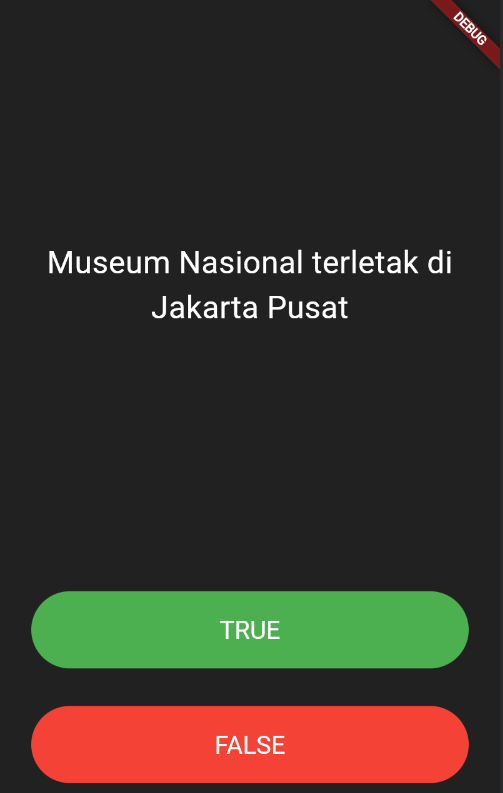
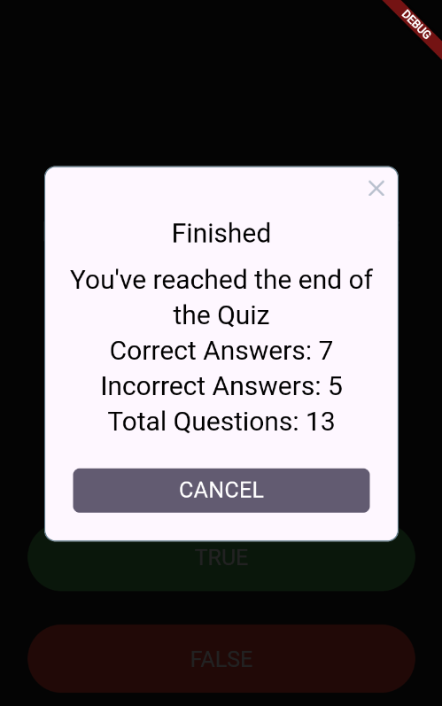

# flutter_kuis_benar_salah

## Nama:

Muhammad Septian Farisasmita 4522210146

## Tujuan Praktikum:

Tujuan Praktikum:
Praktikum ini bertujuan untuk mempelajari cara membangun logika aplikasi kuis sederhana bertipe true/false menggunakan Flutter. Selain itu, praktikum ini juga mengajarkan konsep penggunaan `StatefulWidget`, pengelolaan state, serta integrasi dengan paket eksternal seperti `rflutter_alert` .

## Deskripsi Aplikasi:

Aplikasi ini merupakan kuis interaktif dengan format pertanyaan benar/salah yang mengangkat topik seputar museum-museum di Indonesia. Pengguna diminta untuk menjawab setiap pertanyaan dan akan langsung memperoleh umpan balik atas jawabannya. Sepanjang kuis, aplikasi mencatat jumlah jawaban yang benar dan salah, lalu menampilkan ringkasan hasil akhir setelah semua pertanyaan dijawab.

## Screenshot Emulator:

## Penjelasan Program:

- Aplikasi dibangun dengan **Flutter** menggunakan bahasa pemrograman **Dart**.
- Terdapat 3 file utama:
  - `main.dart`: UI utama dan pengaturan quiz logic.
  - `question.dart`: Kelas model untuk menyimpan pertanyaan dan jawaban.
  - `quiz_brain.dart`: Manajemen pertanyaan dan navigasi kuis.
- Struktur logika:
  - Setiap pertanyaan ditampilkan satu per satu.
  - Jawaban pengguna akan dibandingkan dengan jawaban benar.
  - Score visual ditampilkan melalui icon ✅ atau ❌ di bawah layar.
  - Setelah pertanyaan terakhir, muncul alert menggunakan `rflutter_alert`.
  - Kuis akan di-reset setelah alert ditutup.
- Fitur-fitur penting:
  - Button `TextButton` dengan warna berbeda untuk TRUE dan FALSE.
  - Feedback visual menggunakan widget `Icon`.
  - Menggunakan `Alert` dari package `rflutter_alert` untuk tampilan ringkasan hasil.
  - State dikelola menggunakan `setState()` di dalam `StatefulWidget`.

## Daftar Pertanyaan:

Terdiri dari 13 pertanyaan tentang museum.
