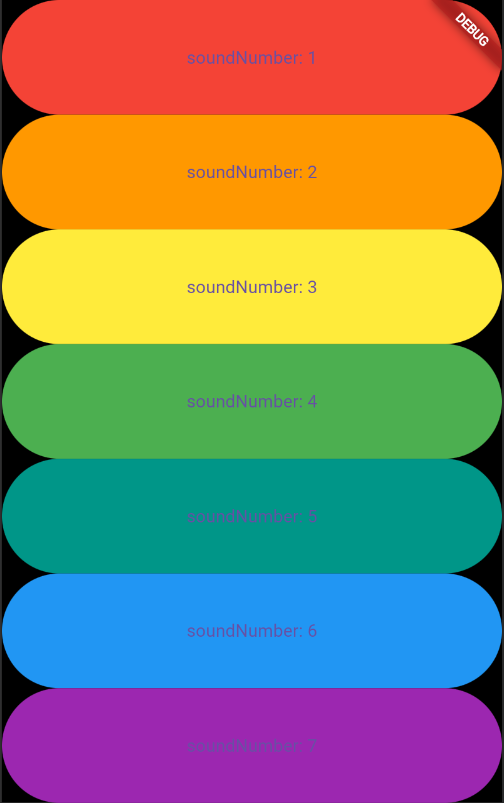

# flutter_xylophone

## Nama:

Muhammad Septian Farisasmita 4522210146

## Tujuan Praktikum:

Praktikum ini bertujuan untuk mempelajari cara kerja dan penerapan pemutar audio sederhana dalam aplikasi Flutter. Fokus utamanya adalah memahami proses pemutaran file audio lokal dengan memanfaatkan paket audioplayers, serta mengembangkan antarmuka pengguna (UI) yang dinamis berbasis widget.

## Deskripsi Aplikasi:

Aplikasi ini mensimulasikan alat musik Xylophone secara sederhana. Pengguna dapat menekan berbagai tombol berwarna, di mana setiap tombol akan menghasilkan bunyi not musik yang berbeda. Aplikasi ini mengilustrasikan hubungan antara warna tombol dan nada atau nomor notasi musik yang dimainkan.

## Screenshot Emulator:



## Penjelasan Program:

- Aplikasi dibangun menggunakan framework Flutter dan bahasa pemrograman Dart.
- Menggunakan package audioplayers untuk memainkan file audio lokal (format .wav) dari folder assets.
- Fungsi utama:
  - playSound(int soundNumber): Memutar file audio note{soundNumber}.wav saat tombol ditekan.
  - buildKey(): Membuat tombol dengan warna berbeda dan mengikatnya dengan fungsi playSound sesuai dengan urutan.
- UI menggunakan:

  - MaterialApp dan Scaffold sebagai kerangka utama aplikasi.
  - SafeArea untuk menjaga tampilan dalam batas area aman layar.
  - Column dan Expanded untuk menyusun tombol vertikal yang proporsional.
  - TextButton sebagai elemen tombol, dengan warna latar belakang dan fungsi pemutaran audio.

- Struktur warna dan suara:
  - Tombol 1 → Warna Merah → note1.wav
  - Tombol 2 → Warna Oranye → note2.wav
  - Tombol 3 → Warna Kuning → note3.wav
  - Tombol 4 → Warna Hijau → note4.wav
  - Tombol 5 → Warna Teal → note5.wav
  - Tombol 6 → Warna Biru → note6.wav
  - Tombol 7 → Warna Ungu → note7.wav

```yaml
dependencies:
  audioplayers: ^5.2.1
```
