# mini_habit_tracker

## Nama :

Muhammad Septian Farisasmita 4522210124

## Tujuan Pembelajaran :

1. Memahami dan menerapkan konsep ephemeral state (state lokal) menggunakan StatefulWidget dan setState() untuk operasi Create, Read, Update, Delete (CRUD).
2. Mengimplementasikan interaksi pengguna melalui AlertDialog untuk input data (tambah/edit) dan konfirmasi (hapus).
3. Mengelola input teks menggunakan TextEditingController dan melakukan validasi dasar dengan Form dan GlobalKey<FormState>.
4. Menggunakan PopupMenuButton untuk menyediakan aksi tambahan pada item dalam daftar.
5. Memodifikasi tampilan item daftar secara dinamis berdasarkan state (misalnya, teks dicoret).
6. Memahami bagaimana perubahan pada list data (penambahan, penghapusan, pembaruan elemen) memicu pembaruan UI ketika dikelola dengan setState().
7. Menganalisis proses rebuild widget menggunakan print statement.

## Deskripsi Aplikasi

Aplikasi ini adalah contoh implementasi deep linking dan navigasi berbasis rute menggunakan Flutter. Aplikasi ini memiliki tiga layar utama:

1. HomeScreen: Layar utama yang menampilkan daftar item.
2. DetailScreen: Layar yang menampilkan detail dari item yang dipilih, termasuk nama dan ID item.
3. SettingsScreen: Layar yang menampilkan halaman pengaturan aplikasi. Aplikasi ini menggunakan Navigator 2.0 yang mengelola rute secara deklaratif, yang memungkinkan kita untuk menangani deep linking dan navigasi antar halaman berdasarkan status aplikasi.

# Screenshot Halaman

## Uji Strikethrough

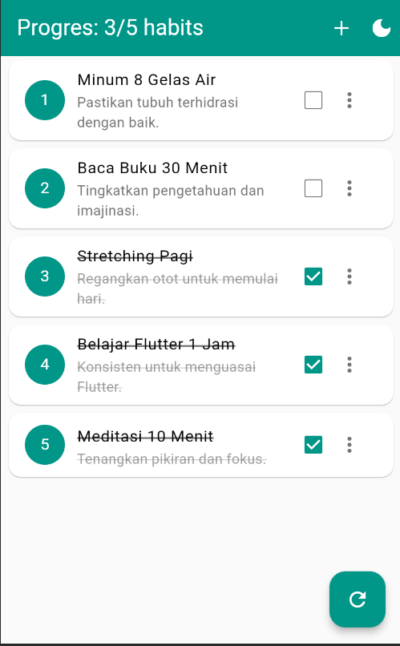

## Uji Tambah Habit

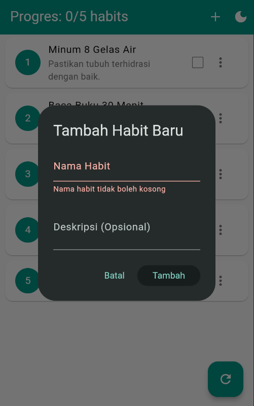

## Sesudah ditambah

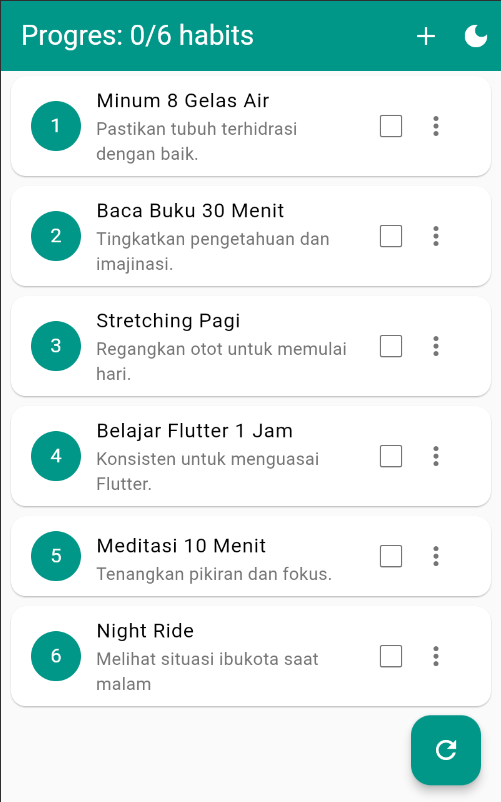

## Uji Edit Habit

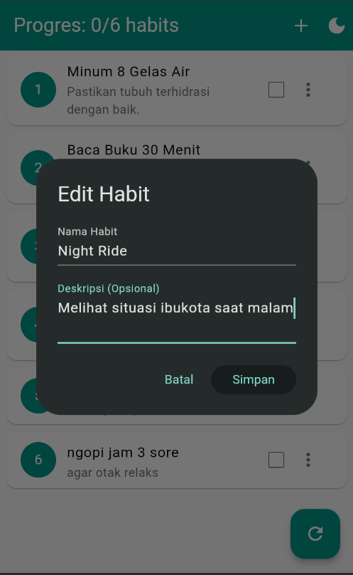

## Sesudah diedit

## Uji Hapus Habit

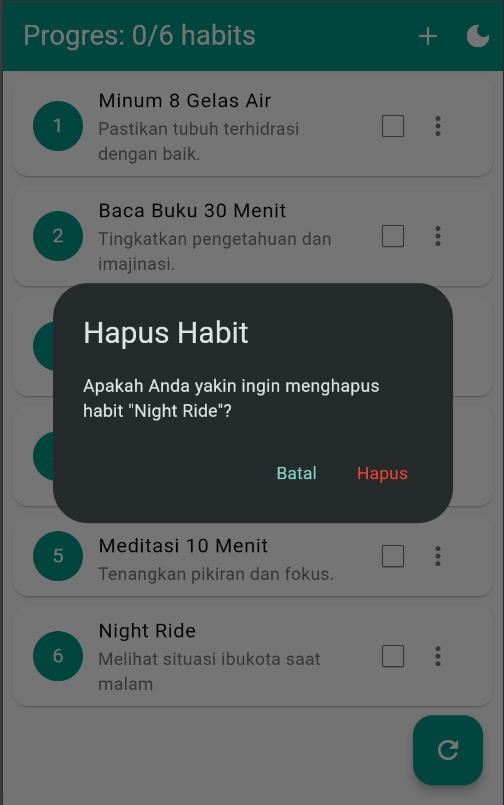

## Sesudah dihapus

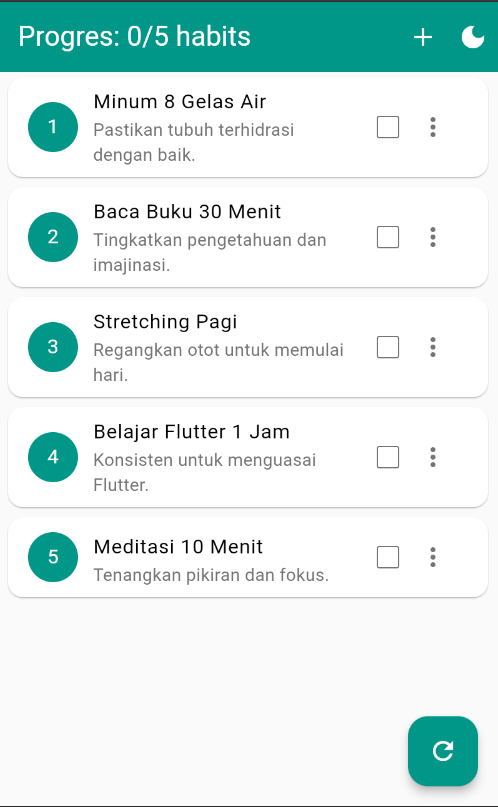

## Uji Progress Bar

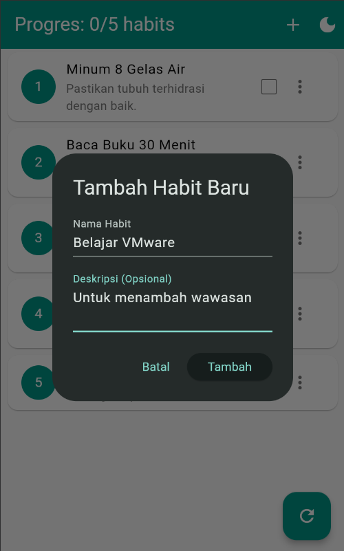
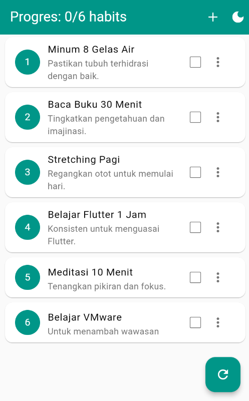
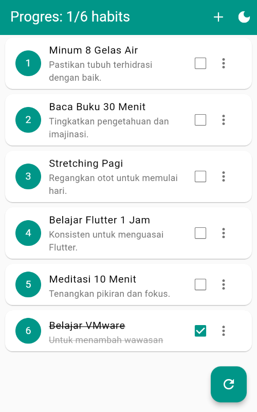
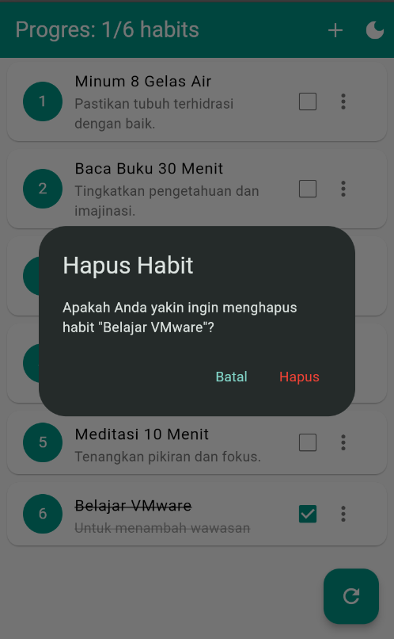
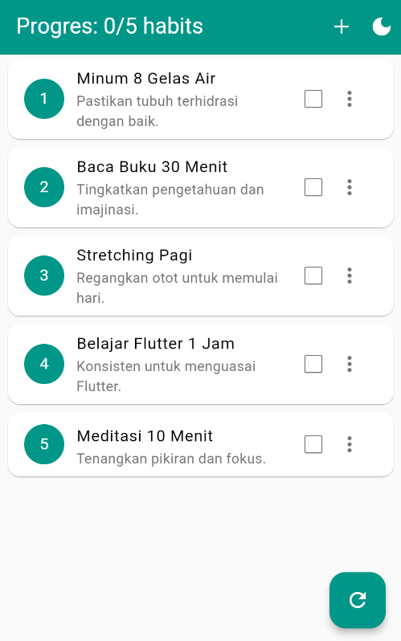

## Uji Reset

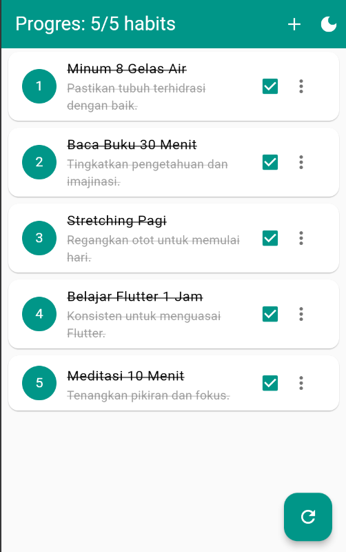

## Sesudah direset

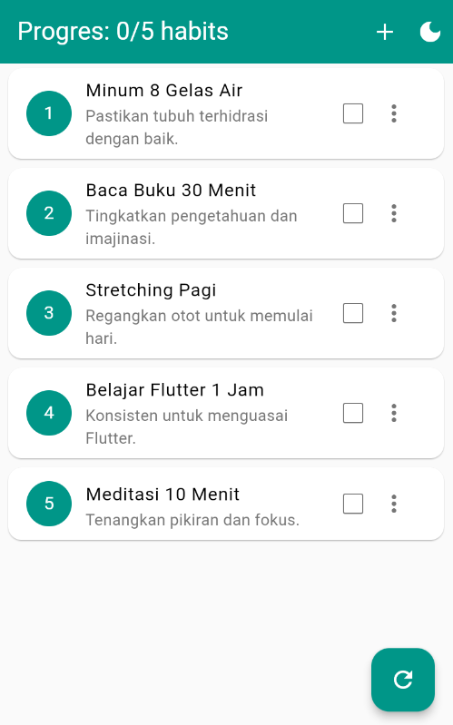

## Uji Ephemeral State

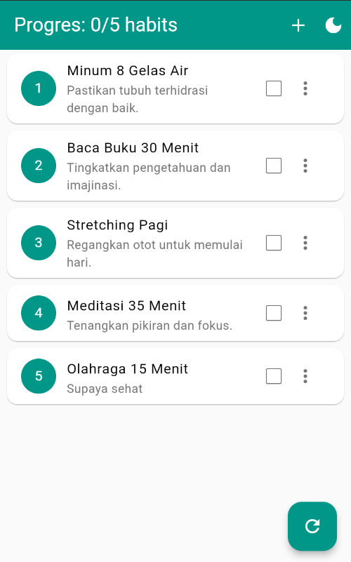
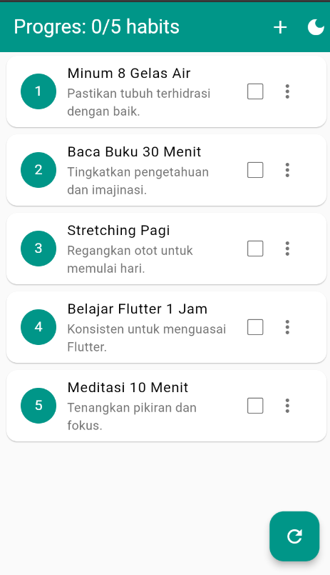

## Ouput Print

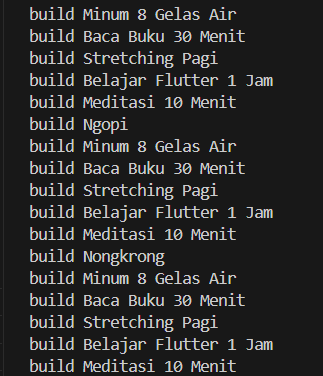
